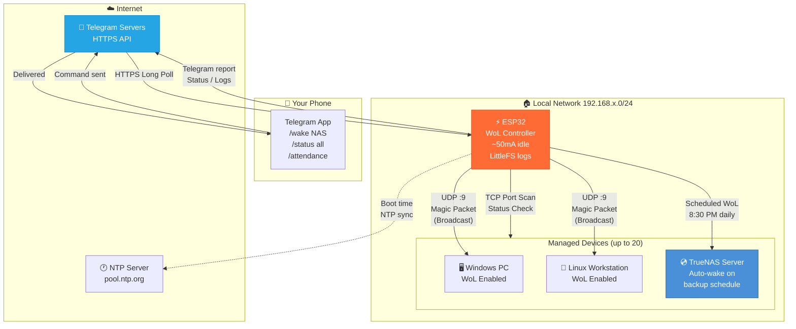

# ESP32 Wake-on-LAN Telegram Bot

<div align="center">


**Control your entire LAN from anywhere — wake, monitor, and automate up to 20 devices via Telegram.**

[Features](#features) · [Architecture](#architecture) · [Quick Start](#quick-start) · [Commands](#telegram-commands) · [Roadmap](#roadmap)

</div>

---

## Why I Built This

I run a small home lab: a TrueNAS server, a few workstations, and a gaming PC — all on the same LAN. The problem: leaving them all powered on 24/7 wastes electricity, but waking them remotely meant either exposing SSH to the internet or manually flipping power switches.

I wanted something that:
- Runs on **3.3V from a USB charger** — always on, costs nothing
- Needs **zero port forwarding or VPN** — works over Telegram's existing HTTPS
- Wakes any device on the network with a phone message
- Automatically checks if my TrueNAS server is online before nightly backups
- Logs every event persistently so I can see what happened while I was away

The result is a v2.1 firmware running on a ₹400 ESP32 that has been managing my home lab for over a year.

---

## Features

| Feature | Description |
|---------|-------------|
| 🔌 **Wake-on-LAN** | Send magic packets to any WoL-enabled device over UDP broadcast |
| 📱 **Telegram Control** | Full bot interface — no app install, works from any device with Telegram |
| 🔒 **Allowlist Auth** | Only your Telegram user ID can issue commands — unauthorized users get rejected |
| 📊 **Daily Attendance** | Scheduled ping sweep at 10:30 AM — reports which devices are online/offline |
| 💾 **TrueNAS Integration** | Checks NAS health at 8:30 PM — auto-wakes it if offline before backup window |
| 📝 **Persistent Logging** | All events written to LittleFS flash with timestamps — survives reboots |
| 📈 **Wake Statistics** | Tracks per-device wake counts and total operations, saved across reboots |
| 🔍 **Device Discovery** | Scans LAN for new devices and prompts to add them to the managed list |
| 🌐 **NTP Time Sync** | Accurate IST timestamps via pool.ntp.org — no RTC module needed |
| ♻️ **Auto-Reconnect** | Recovers from WiFi drops automatically |

---

## Architecture



### Data Flow — Wake Command

```
You type: /wake NAS
    │
    ▼
Telegram Server  ──HTTPS──►  ESP32 (polling every 1s)
                                  │
                                  ├─ Validates your chat ID
                                  ├─ Looks up "NAS" → MAC + IP
                                  ├─ Builds 102-byte magic packet
                                  │   [FF FF FF FF FF FF] + [MAC × 16]
                                  ├─ Sends UDP broadcast to 255.255.255.255:9
                                  ├─ Logs event to LittleFS with timestamp
                                  ├─ Increments wake counter (saved to flash)
                                  └─ Replies "✅ Wake packet sent to NAS"
```

### Storage Layout (LittleFS Flash)

```
/
├── wol_events.log     # Timestamped event log (auto-rotates at 50KB)
├── wol_stats.txt      # Wake counts, uptime, last run times
└── devices.txt        # Persistent device list (survives firmware restarts)
```

---

## Hardware

| Component | Spec | Cost (approx) |
|-----------|------|---------------|
| ESP32 DevKit v1 | Dual-core 240MHz, 4MB flash, WiFi | ~₹400 |
| USB Power Adapter | 5V 1A | ~₹100 |
| USB Micro cable | Any | ~₹50 |

**Total: ~₹550.** No PCB, no soldering, no external components required.

### Power Profile

| State | Current Draw |
|-------|-------------|
| Idle (polling Telegram) | 50–70 mA |
| Sending WoL packet | 80–120 mA for ~100ms |
| Status scan (all devices) | 80–120 mA for 2–5s |
| WiFi reconnect | 150–200 mA for ~2s |

---

## Quick Start

### Prerequisites

- [PlatformIO CLI](https://platformio.org/install/cli) or [VS Code + PlatformIO extension](https://platformio.org/install/ide?install=vscode)
- A Telegram bot token from [@BotFather](https://t.me/BotFather)
- Your Telegram user ID from [@userinfobot](https://t.me/userinfobot)
- Computers with Wake-on-LAN enabled in BIOS

### 1. Clone & Install

```bash
git clone https://github.com/oldregime/esp32-wake-on-lan-telegram.git
cd esp32-wake-on-lan-telegram
pio pkg install
```

### 2. Configure

```bash
cp src/config.h.example src/config.h
```

Edit `src/config.h` with your credentials:

```cpp
// Telegram
#define BOT_TOKEN    "1234567890:ABCDEFabcdefABCDEF1234567890abcdef"
#define ALLOWED_ID   "987654321"

// WiFi
const char* WIFI_SSID     = "YourWiFiName";
const char* WIFI_PASSWORD = "YourWiFiPassword";

// Timezone (IST = UTC+5:30 = 19800 seconds)
#define GMT_OFFSET_SEC      19800
#define DAYLIGHT_OFFSET_SEC 0
```

### 3. Discover Your Devices (Optional)

Run the bundled network scanner from any machine on your LAN:

```bash
pip install requests
python3 scan_network.py
# or specify subnet: python3 scan_network.py 192.168.1
```

This pings the entire `/24` subnet, grabs MAC addresses via ARP, resolves hostnames, and outputs a ready-to-paste C++ device array for `main.cpp`.

Output example:
```
IP               Hostname                  MAC Address        Vendor               Type
192.168.29.1     router                    A8:88:1F:1F:AB:4A  TP-Link              Web Server
192.168.29.167   DESKTOP-WORK              98:FA:9B:F4:54:ED  ASUSTeK              RDP/Windows
192.168.29.179   truenas.local             DC:C2:C9:5A:76:2E  Supermicro           SSH, Web Server
```

### 4. Add Devices to Firmware

Edit the device array in `src/main.cpp`:

```cpp
DeviceConfig devices[MAX_DEVICES] = {
    {"GamingPC",    "AA:BB:CC:DD:EE:FF", "192.168.1.101", 0},
    {"Workstation", "11:22:33:44:55:66", "192.168.1.102", 0},
    {"TrueNAS",     "DC:C2:C9:5A:76:2E", "192.168.1.103", 0},
};
int deviceCount = 3;
```

### 5. Build & Upload

```bash
# Linux/macOS
pio run -e esp32dev --target upload

# Windows (check your COM port in Device Manager first)
pio run -e esp32dev-windows --target upload

# Monitor serial output
pio device monitor --baud 115200
```

---

## Enabling Wake-on-LAN on Your PC

### Windows
1. Device Manager → Network Adapters → Your NIC → Properties
2. **Advanced** tab → Enable **"Wake on Magic Packet"**
3. **Power Management** tab → Enable **"Allow this device to wake the computer"**

### Linux
```bash
# Check current WoL status
sudo ethtool eth0 | grep Wake

# Enable WoL (replace eth0 with your interface)
sudo ethtool -s eth0 wol g

# Persist across reboots (systemd)
sudo tee /etc/systemd/network/10-wol.link << EOF
[Match]
MACAddress=aa:bb:cc:dd:ee:ff

[Link]
WakeOnLan=magic
EOF
```

### TrueNAS / FreeBSD
Admin Panel → Network → Interfaces → Edit → Enable **"Wake on LAN"**

---

## Telegram Commands

| Command | Description |
|---------|-------------|
| `/start` | Show welcome message and command list |
| `/list` | List all configured devices with MAC and IP |
| `/status` | Ping all devices and report online/offline |
| `/status <name>` | Check a specific device (e.g. `/status TrueNAS`) |
| `/wake <name>` | Send WoL magic packet to a device |
| `/wakeall` | Wake all configured devices |
| `/attendance` | Manually trigger the attendance sweep |
| `/truenas` | Check TrueNAS status, auto-wake if offline |
| `/discoverdevice` | Scan LAN for new/unknown devices |
| `/stats` | Show wake counts, uptime, operation totals |
| `/logs` | Show last 10 logged events with timestamps |
| `/uptime` | ESP32 uptime, current time, free heap |
| `/setmac <name> <mac>` | Update a device's MAC address |

---

## Project Structure

```
esp32-wake-on-lan-telegram/
├── .github/
│   └── workflows/
│       └── build.yml          # CI: compiles firmware on every push
├── src/
│   ├── main.cpp               # Firmware (v2.1, ~900 lines)
│   └── config.h.example       # Configuration template (copy → config.h)
├── include/
│   └── README                 # PlatformIO include path note
├── test/                      # Unit test placeholder
├── scan_network.py            # Python network scanner (run on PC, not ESP32)
├── devices_config.txt         # Scanner output — paste into main.cpp
├── devices_detailed.txt       # Detailed scan report
├── platformio.ini             # Build configuration (3 environments)
└── README.md
```

---

## Troubleshooting

| Problem | Cause | Fix |
|---------|-------|-----|
| Bot not responding | Wrong token or user ID | Verify via `@userinfobot` and `@BotFather` |
| WoL not working | BIOS setting off | Enable "Wake on Magic Packet" in BIOS/UEFI |
| WoL not working | Wrong MAC | Re-run `scan_network.py` and verify |
| Won't connect to WiFi | 5GHz network | ESP32 is 2.4GHz only — use 2.4GHz band |
| Time wrong | Wrong GMT offset | Set `GMT_OFFSET_SEC` in config.h (IST = 19800) |
| Upload fails (Windows) | Wrong COM port | Check Device Manager → Ports |

---

## Roadmap

These are planned features — contributions welcome:

- [ ] **Web Dashboard** — ESP32-hosted HTTP UI showing live device status without Telegram
- [ ] **OTA Updates** — Push firmware updates over the air via Telegram command
- [ ] **Scheduled Wake** — Cron-style "wake GamingPC every weekday at 9 AM"
- [ ] **MQTT Bridge** — Publish device states to MQTT for Home Assistant integration
- [ ] **Multi-user Auth** — Allow a list of authorized Telegram IDs (family/team)
- [ ] **Uptime Monitoring** — Alert when a device goes offline unexpectedly
- [ ] **SD Card Logging** — Extended log storage beyond LittleFS for long-term history

---

## Contributing

Pull requests are welcome. For major changes, open an issue first.

```bash
# Fork → clone → create branch
git checkout -b feature/your-feature
# Make changes, then
git push origin feature/your-feature
# Open a PR
```

---

## License

MIT — free to use, modify, and distribute. See [LICENSE](LICENSE).

---

<div align="center">

Built to solve a real problem — keeping my home lab manageable without a static IP, a VPN, or a rack PDU.

**[⭐ Star this repo](https://github.com/oldregime/esp32-wake-on-lan-telegram)** if it helped you.

</div>
